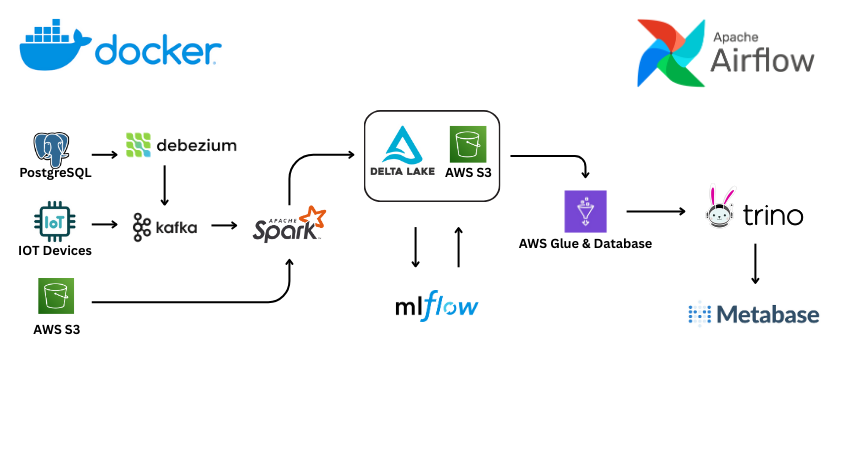

# Claims Data Engineering Platform

### Project Overview

This project sets up a complete, containerized data engineering environment for processing claims data. It leverages a modern data stack, including Change Data Capture (CDC), real-time stream processing, a data lakehouse, and a powerful query engine.

The architecture is designed to ingest data from multiple sources: real-time database changes via CDC, file-based objects (e.g., documents, images) from S3, and high-velocity telematics data from Kafka. These diverse data streams are processed in real-time using Spark, consolidated into a unified Delta Lake on AWS S3, and made available for analytics through Trino and Metabase.

### Architecture

The platform is composed of several services orchestrated by Docker Compose:

1.  **Data Ingestion:** The platform supports multiple ingestion patterns:
    *   **CDC Stream:** For capturing real-time changes from transactional databases.
        *   **PostgreSQL (`postgres`) -> Debezium (`connect`) -> Kafka (`kafka`):** This pipeline streams row-level changes from the `claims_db` database directly into Kafka topics, making updates, inserts, and deletes available for immediate processing.
    *   **Object Stream:** For processing unstructured or semi-structured files.
        *   **S3 Landing Zone:** Files such as images, claim documents, or batch data extracts (CSV, JSON) are uploaded to a designated S3 bucket (a "landing zone"). Spark jobs can then process these files as a continuous stream.
    *   **Telematics Stream:** For high-velocity data from IoT devices.
        *   **Kafka (`kafka`):** Vehicle telematics data (e.g., GPS, accelerometer readings) is expected to be streamed into dedicated Kafka topics. This allows for real-time analysis of driver behavior, incident reconstruction, and usage-based insurance models.

2.  **Stream Processing:**
    *   **PySpark (`pyspark-app`):** A Spark environment for running data processing jobs. It consumes data from all ingestion streams (Kafka, files), performs transformations, and writes the results to the data lake.
    *   **JupyterLab (`jupyter-lab`):** An interactive development environment for creating and testing PySpark applications and notebooks.

3.  **Data Lakehouse & Querying:**
    *   **AWS S3:** The data lakehouse storage layer. Processed data is stored in Delta Lake format in a designated S3 bucket, making it scalable and durable.
    *   **Trino (`trino`):** A high-performance, distributed SQL query engine. It is configured with a Delta Lake connector to query the data stored in the S3 bucket directly. It uses AWS Glue as its metastore to manage table schemas.
    *   **Metabase (`metabase`):** A user-friendly business intelligence and visualization tool. It connects to Trino, allowing for easy exploration, dashboarding, and analysis of the claims data in the Delta Lake.

### Use Cases & Problems Solved

This architecture is designed to solve several common challenges in data engineering:

*   **Unified 360-Degree View:** By combining structured data from databases (CDC Stream), unstructured files like photos and documents (Object Stream), and high-velocity IoT data (Telematics Stream), this platform creates a complete, 360-degree view of each claim and customer. This breaks down data silos and enables holistic analysis.

*   **Real-Time Analytics and Fraud Detection:** Instead of relying on slow, nightly batch jobs, this platform enables real-time monitoring. For example, you can create dashboards to track incoming claims status against SLAs, or build models that analyze telematics data *as it arrives* to flag risky driving behavior or detect fraudulent claim patterns instantly.

*   **Enriched and Automated Claims Processing:** The ability to process unstructured data from the Object Stream (e.g., using OCR on claim forms or image analysis on vehicle damage photos) alongside structured claim data allows for a higher degree of automation and more accurate claim assessment.

*   **Decoupling Analytics from Operational Systems:** Running complex, long-running analytical queries directly against a production database can degrade its performance. This architecture offloads the analytical workload to a separate, optimized system (Spark and Trino), protecting the performance of the source application.

*   **Data Auditing and Historical Analysis:** Delta Lake's "time travel" feature versions the data with every change. This allows you to query the state of a claim or policy at any point in time, which is invaluable for auditing, debugging data pipelines, and reproducing historical reports.

*   **Scalable and Future-Proof Data Platform:** The use of cloud-native, distributed components (Kafka, Spark, S3, Trino) ensures the platform can scale to handle growing data volumes and evolving business requirements, such as adding new data sources or more complex analytical models.
